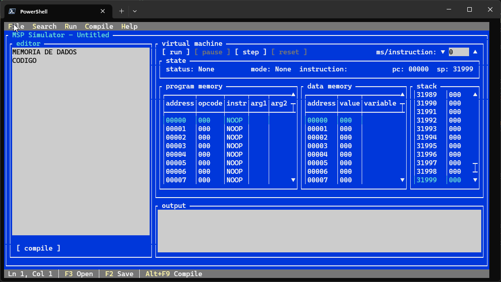
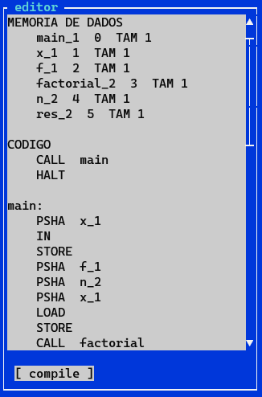
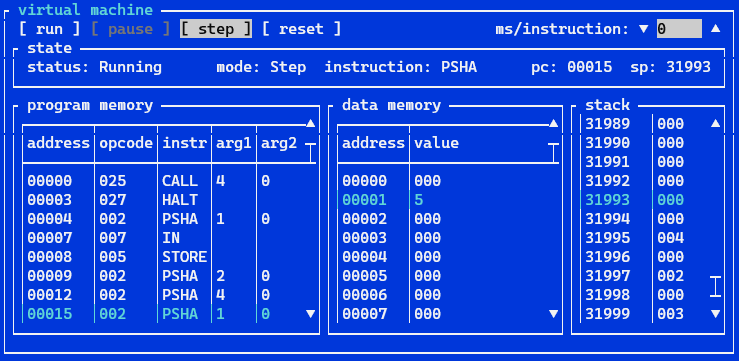
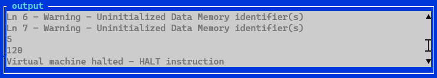
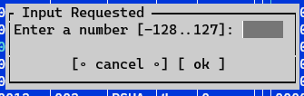
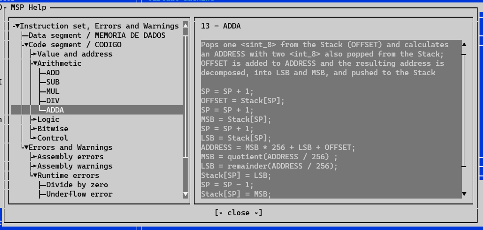

# MSP (*Mais Simples Possível*) Simulator

|  |
|:--:|
| *MSP (Mais Simples Possível) Simulator Console Application* |

## Motivation

This started out as a "let's see how [Superpower](https://github.com/datalust/superpower) works" but quickly became a "what can I use it for?"

For that, I needed to find a small enough language, with just the right amount of complexity. I remembered that, while at [Universidade do Minho](https://www.uminho.pt/), I had used a proto-assembly language. That language was MSP! MSP stands for *Mais Simples Possível* (Portuguese for *The Simplest Possible*).

I knew I had some remnants of MSP code lying around, but that wasn't enough. I remembered that we had had access to a programmer's manual that included the language's BNF grammar and the description of the instruction set. So, the search began...

I looked through my backups, but to no avail. After a "few" web searches I managed to find something that had what I was looking for. [Deep in the pages](https://www.di.uminho.pt/~jas/pli/03-04/pli.html) of the [Departamento de Informática](https://www.di.uminho.pt/), there it was: the archive `WinMSP.tgz`, which contained what I needed.

The `WinMSP.tgz` file contains the MSP language integrated development environment (IDE) (`WINMSP.EXE`) for [Microsoft Windows](https://en.wikipedia.org/wiki/Microsoft_Windows), some examples, and both the user's manual and the programmer's manual (the one I was actually looking for) as `*.doc` files.

In order to help preserve this, I have included the downloaded `WinMSP.tgz`, as is, [in this repository](./assets/WinMSP.tgz). I have also taken the original manuals, in Portuguese, and included them in the repository as `*.pdf`: [user's manual](./assets/MSPUTMAN.pdf) and [programmer's manual](./assets/MSPLPMAN.pdf)1.

The repository's [accompanying documentation](./docs/table-of-contents.md) is a translation, from the original, of the programmer's manual, and few bits from the user's manual.

With the programmer's manual in hand, I then started developing what ended up being a console version of the original WinMSP IDE. The console application has been developed in C# and, by using [.NET Core](https://learn.microsoft.com/en-us/dotnet/core/introduction), it is cross-platform. It has been tested only in Microsoft Windows and [Windows Subsystem for Linux](https://en.wikipedia.org/wiki/Windows_Subsystem_for_Linux)).

## Internals

Development of the MSP Simulator was split by area of concern. This helped keep context boundaries during development and testing. The different areas of concern are briefly described below.

### [Parser](./src/abremir.MSP.Parser/)

This is where it all starts!

This initial stage is where the source code is converted into an internal representation of both the data segment and the code segment, and this is done mainly by leveraging the power (pun intended) of [Superpower](https://github.com/datalust/superpower).

The internal representation generated at the end of this stage, if successful, is what will allow the following stages to be executed.

### [Validator](./src/abremir.MSP.Validator/)

Once the source code has been parsed successfully, having generated internal representations of both the data initializers and the instructions, the actual values, and (potential) relationships between data and instructions, need to be validated.

Data and code validation are done independently, and may generate warnings and/or errors. For a full description of the warnings and errors that can be generated, please take a look at the [documentation for Errors and Warnings](docs/errors-and-warnings.md).

If the outcome of the validation does not contain any errors all is good, and the process can progress to the next stage: assembly.

### [Assembler](./src/abremir.MSP.Assembler/)

The task of the assembler is to convert the internal representation of the source code into a format that the virtual machine can process.

This means the internal representation of the source code will be converted into two sets of data that represent the contents of the two memory blocks of the virtual machine: the Data Memory and the Program Memory.

Aside from this, the assembler will also output a map between the source code line of the code segment and its location the Program Memory, and a map between the data variables and their address in the Data Memory.

### [Compiler](./src/abremir.MSP.Compiler/)

The purpose of the compiler is to wire-up everything and to prepare a payload that is ready to be served to the virtual machine. In order to accomplish this it will leverage the components already described (parser, validator, and assembler).

These components will be invoked sequentially (parser -> validator -> assembler) and, when completed, the compilation result will be composed of the Data Memory, the Program Memory, errors, warnings, mapping of source code line number to Program Memory address, and mapping of data address to variable identifier.

If any of the sub-stages returns errors, the process is stopped.

On a successful compilation, the resulting data memory and program memory can be fed directly to the virtual machine.

### [Virtual machine](./src/abremir.MSP.VirtualMachine/)

Once fed with a compiled data memory and program memory, prepared by the compiler, the virtual machine will be able to run the program it was assigned.

Besides actually executing each of the instructions that compose a program defined in the Program Memory, the virtual machine is in charge of managing internal state: `Mode`, `Status`, `Data Memory`, `Program Memory`, `Stack`, `SP`, `PC`, etc.

The virtual machine will also emit events in order to notify potential subscribers of changes happening inside the virtual machine. These range from when the virtual machine's memory is set, all the way until when the virtual machine has stopped (either intentionally or due to a program error). In fact, these events are what drives the view of the internals of the virtual machine to be updated while a program is being executed.

Please note that the current implementation of the virtual machine does not exactly match the outlined in the [architecture documentation](./doc/../docs/architecture.md), but the outcome is expected to be the same.

### [Integrated Development Environment](./src/abremir.MSP.IDE.Console/)

The MSP Simulator IDE, as shown above, is a console application built using the cross-platform terminal UI toolkit [Terminal.Gui](https://github.com/gui-cs/Terminal.Gui).

Its main purpose is to interact with the MSP virtual machine. In this case, this is done via the use of visual elements, which can be decomposed into 3 main areas:

- a code editor window;
- a virtual machine (VM) control and status window;
- and input/output;

The IDE also provides an integrated help window.

#### Code editor

---

The code editor, where the user can type code directly or have code be loaded from file. A few [examples](./src/abremir.MSP.IDE.Console/Examples/) are included.

|  |
|:--:|
| *MSP code editor window* |

Once code is loaded to the editor window it can, then, be loaded to the MSP virtual machine by clicking the `compile` button. This will trigger parsing, validation, assembling, and compiling the code to a form understandable by the VM.

If any warnings or errors are to be shown to the user, they will be so in the IDE's output window.

#### Virtual machine control and status window

---

Through the virtual machine control and status window the user can control how the program runs and view the internal status of the VM.

The virtual machine state panel displays the current `status` of the VM, the current running `mode`, the `instruction` currently being executed, the program counter `pc`, and the stack pointer `sp`.

The loaded compiled program can be seen in the `program memory` and `data memory` panels. The `stack` panel will display the contents of the stack as the program is executed.

|  |
|:--:|
| *MSP virtual machine control and status view panel* |

After the code is loaded to the VM, it can be run in one of two modes: `run` or `step`.

`run` will execute the full program without interruption, unless mandated by the code, until the program ends. This can further be controlled by adjusting the wait time between instructions `ms/instruction`. If this is set to 0 the program will run without any visible internal state updates, so it is recommended to set this value to a minimum of 1 (as seen in the [screen capture](./assets/msp-ide-console.webp) above).

While the program is being executed in the `run` mode, the user will also have access to the `pause` button. Clicking this button will, as the name implies, pause execution.

On the other hand, `step` allows the user to control when the next instruction is executed, leaving enough time to analyze the virtual machine's internal state.

The user will also have access to a `reset` button (only while the program is being executed), which will reset the virtual machine's internals (`pc`, `sp`, `data memory`, and `stack`) to its initial state (similar to the state right after a program has been compiled and loaded to the VM).

#### Input/Output

---

The MSP language includes two methods to interact with the user. These are the `input` and `output` ports.

|  |
|:--:|
| *MSP output window* |

The `output` port is linked to the computer screen, in this case the IDE's output window, and this is where all warning and error messages, and programmed output will be displayed to the user.

|  |
|:--:|
| *MSP input modal* |

On the other hand, the `input` port is linked to the computer's keyboard, in this case a modal window in the IDE, and interaction is achieved by requesting the user to enter either a number or one ASCII character.

#### MSP Help

---

The MSP help window (F1) provides a quick to access description of the MSP assembly programming language, with its syntax and semantics, and a list of errors and warnings that may be raised while compiling source code or running programs.

|  |
|:--:|
| *MSP help window* |

## Disclaimer

The source code is provided "as-is", use at your own risk.

## Acknowledgements

- `WinMsp.tgz` [Departamento de Informática da Universidade do Minho, Portugal](http://www.di.uminho.pt/~jas/Research/LRC/rpms/WinMSP.tgz) | [MSP Simulator repository copy](./assets/WinMSP.tgz)
- [Architecture diagram for the MSP stack virtual machine](http://gec.di.uminho.pt/lcc/sc0708/proj.html)
- José Carlos Rufino Amaro and Jorge Alexandre Santos
- [Superpower](https://github.com/datalust/superpower)
- [Terminal.Gui](https://github.com/gui-cs/Terminal.Gui)

---

[1] the original user's manual has been adjusted to include the missing diagram for the architecture of the MSP stack virtual machine, which was downloaded from [here](http://gec.di.uminho.pt/lcc/sc0708/proj.html)
