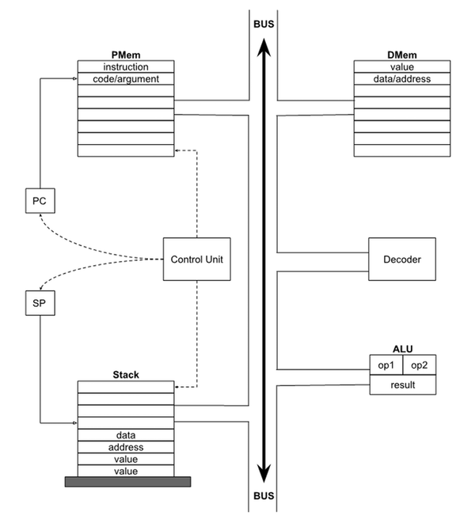

# [MSP - *Mais Simples Possível*](table-of-contents.md)

# Stack Virtual Machine

## Architecture

---

MSP has been developed to make use of a [Stack-Based Virtual Machine](https://en.wikipedia.org/wiki/Stack_machine) as described below.

The main components in a Stack machine are as follows:

- **Memory**, to store instructions and values; there are 3 independent blocks, each with distinct functionality:
  - Program Memory
  - Data Memory
  - Stack
- **Decoder**, to interpret and issue execution commands for each instruction;
- **Arithmetic Logic Unit (ALU)**, where all basic arithmetic and logic operations are executed; on each instruction, the ALU takes the operands from the bus, executes the required operation, and places the result in the bus;
- **Input & Output (I/O)**, two special memory positions, at fixed addresses (`input` and `output`), that have the special characteristic of being directly linked to the "outside world", allowing values to be sent into the machine and to have values output by the machine; in concrete terms, these special memory cells are connected, respectively, to the keyboard and to the monitor;
- **Internal Bus**, a pathway connecting the different units, allowing the movement of instructions and values;
- **Program Counter (`PC`) and Stack Pointer (`SP`)**, two fundamental registers (in fact, the only registers present in the Stack Virtual Machine!) that contain, respectively, the address of the Program Memory with the next instruction to be executed and the address of the first free cell in the Stack (i.e., one cell ahead of the current value at the top of the stack);

|  |
|:--:|
| *Architecture for the MSP Stack Virtual Machine* |

Each memory cell (Program Memory, Data Memory, or Stack) has a capacity of one byte, and is associated with an address that identifies it.

The total number of cells is always finite and well defined, in the present case being 32000. This means the addressable space of the Stack Virtual Machine is limited to the interval [0, 31999].

Each byte stored in a memory cell can represent an instruction, an argument, an integer, a character, or part of an address.

It is up to the virtual machine to interpret the meaning of each byte it is trying to access:

- the **Program Memory** holds the program loaded to the virtual machine; each cell of the Program Memory can contain the operation code of one instruction or the argument of one instruction; most MSP instructions do not have arguments but, in case there are, they will be placed in the cell(s) immediately following the operation code of the instruction;
- the **Data Memory** stores data values; the values can be program data or results calculated by the program; each value, being a byte, can represent numbers in the interval [-128, 255], or characters (the value being defined by the ASCII table), or yet addresses within the Data Memory (in which case they will occupy two bytes);
  - **note** - numbers are allowed to belong to the interval [-128, 255] (384 unique numbers), even though we are only using one byte (256 unique numbers), because the virtual machine will use contextual interpretation of the contents of each cell: if the context demands an address, the value will be interpreted in the range [0, 255], whereas if the context requires an 8-bit signed number, it will be converted to the range [-128, 127]; negative numbers are explained in detail [in a separate chapter](negative-numbers.md);
- the **Stack** is a work memory similar in content to the Data Memory; however, being a stack, you can only read (`pop`) the last value stored (`push`) in it (Last In First Out, LIFO); because of this, the top of the stack grows from the end of the addressable memory (address 31999) towards the start (address 0);
